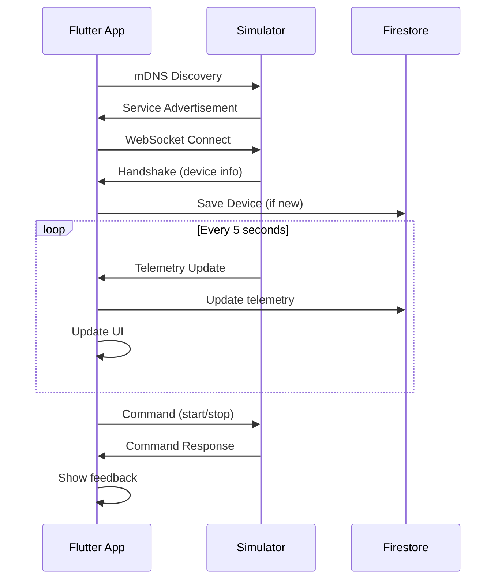

# 🔌 WiseCar EV Charger Simulator - Complete Documentation

## 📋 Table of Contents

1. [🎯 Overview](#overview)
2. [🚀 Quick Start](#quick-start)  
3. [🔧 Server Setup](#server-setup)
4. [🎛️ Web Dashboard](#web-dashboard)
5. [📱 Flutter Integration](#flutter-integration)
6. [💾 Firestore Structure](#firestore-structure)
7. [🔄 Real-time Data Flow](#real-time-data-flow)
8. [🧪 Testing Guide](#testing-guide)
9. [🚨 Troubleshooting](#troubleshooting)
10. [📊 API Reference](#api-reference)

---

## 🎯 Overview

The WiseCar EV Charger Simulator is a **complete WebSocket server** that mimics a real EV charger device. It enables Flutter app development and testing without expensive physical hardware.

### **Key Features:**
- ✅ **Wi-Fi Mode Only** - Simplified, production-focused simulation
- ✅ **mDNS Discovery** - Apps can find the device automatically  
- ✅ **Real-time Telemetry** - Live data every 5 seconds
- ✅ **Command Processing** - Start/stop charging, set limits
- ✅ **Web Dashboard** - Beautiful monitoring interface
- ✅ **Firestore Integration** - Complete data management guide
- ✅ **Auto Port Detection** - No more port conflicts

---

## 🚀 Quick Start

### **1. Installation (One Time)**
```bash
# Navigate to project folder
cd f:\server

# Install dependencies
npm install

# Verify files exist
ls
# Should show: server-simple.js, dashboard.html, package.json, etc.
```

### **2. Start the Simulator (Choose One)**

#### **Option A: Web Dashboard (Recommended)**
```bash
npm run dashboard
```
Then open: `http://localhost:8080`

#### **Option B: Direct Server**
```bash
npm start
# OR
node server-simple.js
```

#### **Option C: Windows Menu**
```bash
start.bat
```

### **3. Test Connection**
```bash
# In a new terminal
npm test
# OR
node test-client.js ws://localhost:3000
```

---

## 🔧 Server Setup

### **A. Server Configuration**
The simulator automatically:
- Finds available ports (3000, 3001, 3002, etc.)
- Detects local IP address  
- Publishes mDNS service `_wisecar._tcp.local`
- Handles multiple client connections

### **B. Console Output**
```
🔌 WiseCar Charger Simulator Starting...
📡 Mode: Wi-Fi
🌐 WebSocket Server: ws://192.168.1.50:3000
🔍 Also available on: ws://localhost:3000
📻 mDNS Service: wisecharger-mock-1758887402924.local:3000
📋 Service Type: _wisecar._tcp.local
✅ WiseCar Charger Simulator ready for connections!
```

### **C. Server Management**
```bash
# Start server
npm start

# Stop server  
Ctrl+C

# Check if running
netstat -ano | findstr :3000

# Force kill (if needed)
taskkill /f /im node.exe
```

---

## 🎛️ Web Dashboard

### **A. Access Dashboard**
1. Run: `npm run dashboard`
2. Open: `http://localhost:8080`
3. Click "Start Server" 
4. Click "Connect & Test"

### **B. Dashboard Features**

#### **Server Control**
- ✅ Start/Stop simulator
- ✅ Connection status monitoring
- ✅ Auto port detection display
- ✅ **Disconnect button** for clean reconnection

#### **Live Telemetry Display**  
- ✅ Real-time voltage (220-240V)
- ✅ Current draw (0-16A)
- ✅ Energy consumption (kWh)  
- ✅ Temperature monitoring (30-50°C)
- ✅ Charging status indicator

#### **Control Panel**
- ✅ Start/Stop charging buttons
- ✅ Current limit slider (6-16A)
- ✅ Energy counter reset
- ✅ Command response feedback

#### **Activity Log**
- ✅ All messages and responses
- ✅ Connection events
- ✅ Error notifications
- ✅ Clear log functionality

---

## 📱 Flutter Integration

### **A. Complete Integration Flow**

#### **Step 1: Device Discovery**
```dart
// 1. Scan for mDNS devices
final devices = await DeviceDiscoveryService().scanForDevices();

// 2. Show available devices to user
// 3. User selects device to add
```

#### **Step 2: WebSocket Connection**
```dart  
// 1. Connect to selected device
final success = await wsService.connect(device.websocketUrl);

// 2. Receive device handshake with info
wsService.handshakeStream.listen((handshake) {
  // Device info received - save to Firestore
});

// 3. Start receiving live telemetry
wsService.telemetryStream.listen((telemetry) {
  // Update UI and Firestore every 5 seconds
});
```

#### **Step 3: Firestore Storage**
```dart
// Admin enters once (when adding device):
- ownerUid (from Firebase Auth)
- displayName (user input)  
- settings.costPerKWh (user input)
- createdAt (timestamp)
- warranty.start
- warranty.end

// From device handshake (automatic):
- deviceId, info.*, network.*, settings.*

// Live updates (every 5 seconds):  
- telemetry.* (voltage, current, energy, temperature, status)
```

### **B. Key Flutter Components**

#### **Device Discovery Service**
```dart
class DeviceDiscoveryService {
  Future<List<DiscoveredDevice>> scanForDevices() async {
    // mDNS scan implementation
    // Returns list of found WiseCar devices
  }
}
```

#### **WebSocket Service**  
```dart
class ChargerWebSocketService {
  Stream<DeviceHandshake> get handshakeStream;
  Stream<TelemetryData> get telemetryStream;
  Stream<CommandResponse> get commandResponseStream;
  
  Future<bool> connect(String url);
  Future<void> startCharging();
  Future<void> stopCharging();  
  Future<void> setCurrentLimit(int amperes);
  void disconnect();
}
```

#### **Firestore Service**
```dart  
class DeviceFirestoreService {
  Future<String> addDevice(DeviceHandshake handshake);
  Future<void> updateTelemetry(String docId, Telemetry telemetry);
  Stream<List<FirestoreDevice>> getUserDevices();
}
```

### **C. UI Screens**
1. **DeviceDiscoveryScreen** - Scan and list available chargers
2. **ChargerControlScreen** - Real-time control and monitoring
3. **MyDevicesScreen** - Saved devices from Firestore

---

## 💾 Firestore Structure

### **A. Device Document Example**
```json
{
  // Admin fields (entered once)
  "ownerUid": "user123",
  "displayName": "Home Garage Charger",
  "createdAt": 1758827731,
  "costPerKWh": 0.15,
  
  // Device fields (from handshake)
  "deviceId": "device_mock_001",
  "info": {
    "firmware": "v2.1.4",
    "model": "WiseCharger Pro AC22", 
    "phases": 1,
    "rfidSupported": true,
    "serial": "WC-MOCK-123456"
  },
  "warranty": {
    "start": 1758827716,
    "end": 1821899716
  },
  "network": {
    "lastIp": "192.168.1.50",
    "mode": "wifi"
  },
  "settings": {
    "appNotifications": true,
    "autoPlug": true,
    "deviceNotifications": false,
    "fastCharging": true, 
    "language": "en",
    "limitA": 16
  },
  
  // Live telemetry (updated every 5 seconds)
  "telemetry": {
    "status": "charging",
    "voltage": 232.4,
    "currentA": 12.5,
    "energyKWh": 1.25,
    "temperatureC": 42.3,
    "phases": 1,
    "updatedAt": 1758828000
  }
}
```

### **B. Data Update Strategy**

#### **One-Time Updates** (Admin)
- Device added to account → Set `ownerUid`, `displayName`, `costPerKWh`
- User renames device → Update `displayName`
- User changes electricity cost → Update `costPerKWh`

#### **Device Connection** (Handshake)  
- WebSocket connects → Update `deviceId`, `info.*`, `network.*`, `settings.*`
- IP address changes → Update `network.lastIp`

#### **Real-time Updates** (Every 5 seconds)
- Telemetry received → Update entire `telemetry.*` object
- Charging starts/stops → `telemetry.status` changes
- Energy increases → `telemetry.energyKWh` increments

---

## 🔄 Real-time Data Flow

### **A. Connection Sequence**


### **B. Message Types**

#### **1. Handshake (Simulator → App)**
```json
{
  "event": "hello",
  "deviceId": "device_mock_001",
  "displayName": "Simulator Charger",
  "info": { "model": "WiseCharger Pro AC22", ... },
  "warranty": { "start": 1758827716, ... },
  "network": { "lastIp": "192.168.1.50", ... },
  "settings": { "limitA": 16, ... }
}
```

#### **2. Live Telemetry (Simulator → App)**  
```json
{
  "event": "telemetry",
  "deviceId": "device_mock_001", 
  "telemetry": {
    "status": "charging",     // "connected" or "charging"
    "voltage": 232.4,        // 220-240V
    "currentA": 12.5,        // 0-16A (based on limit & load)
    "energyKWh": 1.25,       // Cumulative energy
    "temperatureC": 42.3,    // 30-50°C
    "phases": 1,
    "updatedAt": 1758828000  // Unix timestamp
  }
}
```

#### **3. Commands (App → Simulator)**
```json
// Start charging
{"action": "start"}

// Stop charging
{"action": "stop"}  

// Set current limit
{"action": "set_limitA", "value": 12}

// Reset energy counter
{"action": "reset_energy"}
```

#### **4. Command Responses (Simulator → App)**
```json
// Success
{"ack": true, "msg": "Charging started"}

// Error  
{"ack": false, "msg": "Already charging"}
```

---

## 🧪 Testing Guide

### **A. Simulator Testing**

#### **Test 1: Basic Connection**
```bash
# Terminal 1: Start simulator
npm start

# Terminal 2: Test connection  
npm test

# Expected output:
# ✅ Connected to simulator
# 👋 Handshake received
# 📊 Telemetry updates every 5s
# ✅ Command responses
```

#### **Test 2: Web Dashboard**
```bash  
# Start dashboard
npm run dashboard

# Open http://localhost:8080
# Click "Start Server" → "Connect & Test"
# Watch live telemetry updates
# Test start/stop buttons
```

#### **Test 3: Multiple Connections**
```bash
# Start simulator
npm start

# Connect multiple test clients
node test-client.js ws://localhost:3000
node test-client.js ws://localhost:3000  

# Both should receive telemetry
```

### **B. Flutter App Testing**

#### **Integration Test Checklist**
- ✅ mDNS discovery finds simulator
- ✅ WebSocket connection succeeds  
- ✅ Handshake data received correctly
- ✅ Telemetry updates UI every 5 seconds
- ✅ Commands send and receive responses
- ✅ Firestore saves device info
- ✅ Firestore updates telemetry data
- ✅ Reconnection works after disconnect
- ✅ UI handles connection errors gracefully

#### **Test Scenarios**
```dart
// Test Cases
void main() {
  testWidgets('Device Discovery', (tester) async {
    // Verify mDNS scanning works
    // Verify device list populates
    // Verify tap to connect navigation
  });
  
  testWidgets('Real-time Telemetry', (tester) async {  
    // Connect to simulator
    // Verify telemetry displays
    // Verify UI updates every 5 seconds
    // Verify charging status changes
  });
  
  testWidgets('Control Commands', (tester) async {
    // Test start charging button
    // Test stop charging button  
    // Test current limit slider
    // Test reset energy button
    // Verify success/error feedback
  });
}
```

---

## 🚨 Troubleshooting

### **A. Server Issues**

#### **Problem: Port Already in Use**
```
Error: listen EADDRINUSE: address already in use 0.0.0.0:3000
```
**Solution**: Simulator auto-finds available ports. Check console output:
```
🌐 WebSocket Server: ws://192.168.1.50:3002  ← Use this port!
```

#### **Problem: mDNS Service Conflicts**
```
Error: Service name is already in use on the network  
```
**Solution**: Server uses unique timestamps in service names. Restart clears conflicts.

#### **Problem: Connection Refused**
```
❌ Connection error: connect ECONNREFUSED
```
**Solutions**:
1. Check server is running: `npm start`
2. Verify correct IP/port from console output
3. Check Windows Firewall allows Node.js
4. Try `ws://localhost:3000` instead of IP

### **B. Flutter Integration Issues**

#### **Problem: mDNS Discovery Fails**
**Solutions**:
1. Install Bonjour Print Services (Windows)
2. Check same network (device and phone/computer)
3. Use direct IP connection as fallback
4. Check `multicast_dns` package version

#### **Problem: WebSocket Won't Connect**  
**Solutions**:
1. Verify simulator running and port correct
2. Check network permissions in AndroidManifest.xml
3. Test with web dashboard first
4. Use IP address instead of localhost

#### **Problem: Telemetry Not Updating**
**Solutions**:
1. Check WebSocket connection status
2. Verify JSON parsing of telemetry messages
3. Check Firestore update permissions
4. Look for console errors in Flutter debug

#### **Problem: Commands Don't Work**
**Solutions**:
1. Verify WebSocket connection active
2. Check JSON format: `{"action": "start"}`
3. Wait for command response before sending next
4. Check simulator console for received commands

### **C. Firestore Issues**

#### **Problem: Permission Denied**  
**Solutions**:
1. Check Firebase Auth user is logged in
2. Verify Firestore security rules allow user writes
3. Check internet connection
4. Verify Firebase project configuration

#### **Problem: Telemetry Updates Too Frequent**
**Solution**: Implement throttling:
```dart
// Only update Firestore every 30 seconds, not every 5 seconds
Timer.periodic(Duration(seconds: 30), (timer) {
  updateFirestoreTelemetry();
});
```

---

## 📊 API Reference

### **A. WebSocket Endpoints**

| Mode | URL Pattern | mDNS Service | Port |
|------|-------------|--------------|------|  
| **Wi-Fi** | `ws://[IP]:[PORT]` | `wisecharger-mock-[timestamp].local` | Auto (3000+) |

### **B. Message Reference**

#### **Handshake Message**
```typescript
interface DeviceHandshake {
  event: "hello";
  deviceId: string;
  displayName: string;
  info: {
    firmware: string;      // e.g. "v2.1.4"
    model: string;         // e.g. "WiseCharger Pro AC22"  
    phases: number;        // Always 1
    rfidSupported: boolean; // Always true
    serial: string;        // e.g. "WC-MOCK-123456"
  };
  warranty: {
    start: number;         // Unix timestamp
    end: number;          // Unix timestamp
  };
  network: {
    lastIp: string;       // Current IP address
    mode: "wifi";         // Always "wifi"
  };
  settings: {
    appNotifications: boolean;
    autoPlug: boolean;
    costPerKWh: number;        // Always 0 (set by admin)
    deviceNotifications: boolean;
    fastCharging: boolean;
    language: string;          // e.g. "en"
    limitA: number;           // 6-16 (current limit)
  };
}
```

#### **Telemetry Message**  
```typescript
interface TelemetryMessage {
  event: "telemetry";
  deviceId: string;
  telemetry: {
    status: "connected" | "charging";
    voltage: number;      // 220-240V (realistic fluctuation)
    currentA: number;     // 0-16A (based on charging & limit)
    energyKWh: number;    // Cumulative, increases during charging
    temperatureC: number; // 30-50°C (higher when charging)
    phases: number;       // Always 1
    updatedAt: number;    // Unix timestamp
  };
}
```

#### **Commands**
```typescript
// Start charging
{ action: "start" }

// Stop charging  
{ action: "stop" }

// Set current limit (6-16A)
{ action: "set_limitA", value: number }

// Reset energy counter
{ action: "reset_energy" }
```

#### **Command Responses**
```typescript
interface CommandResponse {
  ack: boolean;    // true = success, false = error
  msg: string;     // Human-readable message
}

// Examples:
{ ack: true, msg: "Charging started" }
{ ack: false, msg: "Already charging" }
{ ack: true, msg: "Limit set to 12A" }
{ ack: false, msg: "Invalid limit (must be 6-16A)" }
```

### **C. Behavioral Specifications**

#### **Telemetry Behavior**
- **Frequency**: Exactly every 5 seconds
- **Voltage**: Realistic fluctuation 220-240V
- **Current**: 0A when not charging, 80-100% of limit when charging
- **Energy**: Increases based on: `(current × voltage / 1000) × (5/3600)` kWh per update  
- **Temperature**: 30-50°C base, +5°C when charging
- **Status**: "connected" when idle, "charging" when active

#### **Command Behavior**  
- **start**: Only works if status="connected"
- **stop**: Only works if status="charging"  
- **set_limitA**: Accepts 6-16, affects current draw immediately
- **reset_energy**: Sets energyKWh back to 0

---

## 🎯 Summary

This documentation provides everything needed to:

1. ✅ **Set up the simulator** with Wi-Fi mode and web dashboard
2. ✅ **Connect Flutter apps** using mDNS discovery and WebSocket  
3. ✅ **Integrate with Firestore** for device storage and telemetry
4. ✅ **Handle real-time data** with proper UI updates
5. ✅ **Test thoroughly** with multiple connection scenarios
6. ✅ **Troubleshoot issues** with comprehensive error solutions

**The simulator is now production-ready for Flutter EV charger app development! 🔌⚡**

---

**Quick Links:**
- 📁 **Files**: `server-simple.js`, `dashboard.html`, `flutter-integration.md`  
- 🚀 **Start**: `npm run dashboard` → `http://localhost:8080`
- 🧪 **Test**: `npm test`
- 📱 **Flutter**: Follow `flutter-integration.md` guide